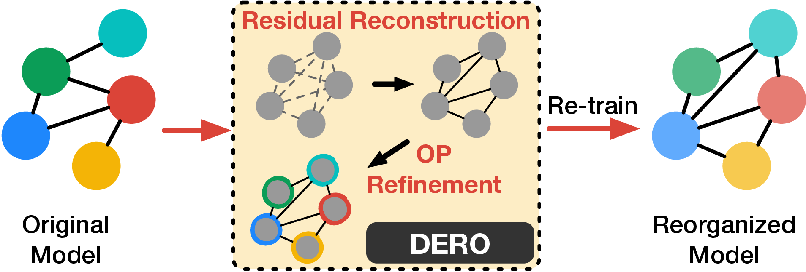
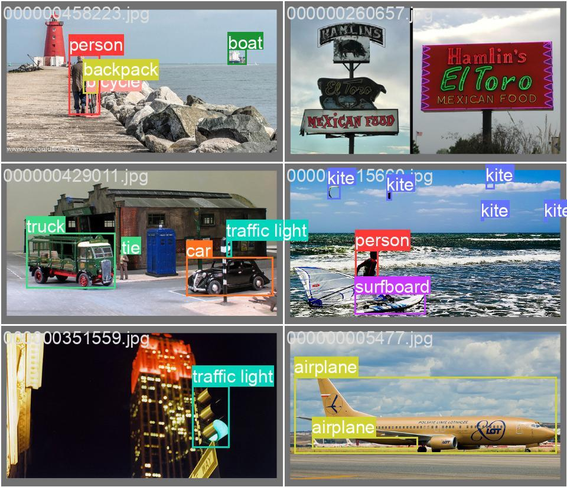
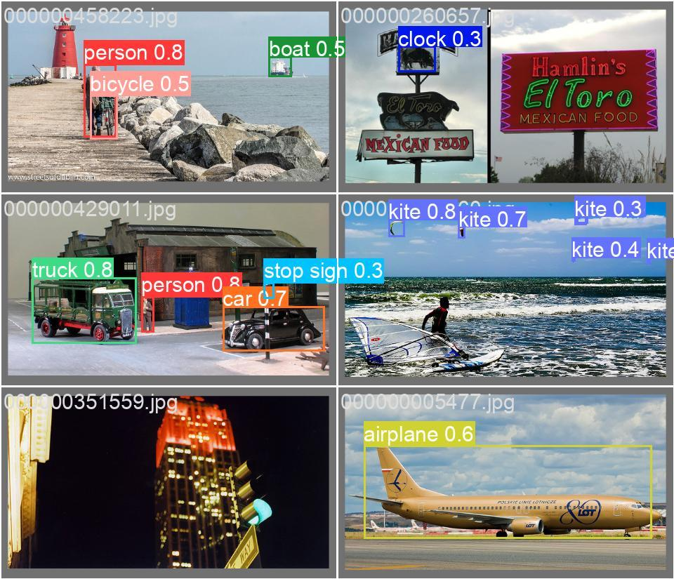
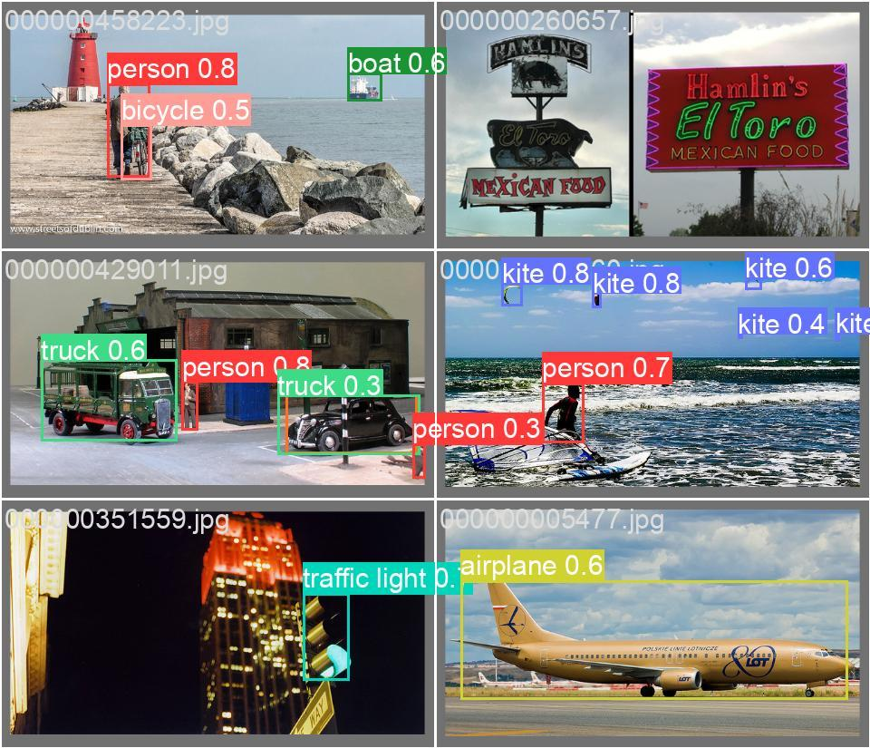

# Deep Reorganization (DERO): Retaining Residuals for TinyML
</br>
DERO is an approach that optimizes models at the graph level by reorganizing residual connections. This approach maintains the same level of inference peak memory requirement as a plain-style model, while preserving the accuracy and training efficiency of the original model with residuals.</br></br>


This repository contains the training scripts used to evaluate DERO. Kindly follow the steps mentioned below to reproducible our results.</br>
All models were trained using eight GTX2080Ti GPUs.</br>

## Requirements
- Python>=3.7.0 

- Pytorch>=1.7.1

## Initial steps
Clone repo and install requirements.txt in a Python>=3.7.0 environment.
```bash
pip install -r requirements.txt
```

## Training

Training for baseline models:
```bash
torchrun --nproc_per_node=8 train.py --model resnet34 --data-path <PATH_TO_DATASET> --amp --output-dir <PATH_TO_MODEL_OUTPUT> -b 64 --wd 0.00004 --random-erase 0.1 --label-smoothing 0.1 --mixup-alpha 0.2 --cutmix-alpha 1.0
                                             resnet50
                                             mcunet_v4
                                             densenet121
```

Training for DERO models:
```bash
torchrun --nproc_per_node=8 train.py --model resnet34dero --data-path <PATH_TO_DATASET> --amp --output-dir <PATH_TO_MODEL_OUTPUT> -b 64 --wd 0.00004 --random-erase 0.1 --label-smoothing 0.1 --mixup-alpha 0.2 --cutmix-alpha 1.0
                                             resnet50dero
                                             mcunet_dero_v4
                                             densenet121_dero
```

## Evaluate
Testing for models:

```bash
python train.py --model <MODEL_NAME> --data-path <PATH_TO_DATASET> -b 64 --test-only --weights <PATH_TO_MODEL>
```

## Comparision
||YOLOV5 (Plain)|YOLOV5 (DERO)|
|---|---|---|
|Ground truth|||
|Predicted result|||

## Pretrained Checkpoints
|Models|Accuracy|Parameters (M)|Training time|Latency (S)|Peak memory (KB)|Architecture|Links|
|---|---|---|---|---|---|---|---|
|ResNet34(DERO)|72.32%|20.64|24:23:29|167.0|294.0|[Orig.](./arch/traced_resnet34_model.png)/[DERO](./arch/traced_resnet34dero_model.png)|[Link]()|
|ResNet50(DERO)|75.56%|21.78|25:53:13|169.9|294.0|[Orig.](./arch/traced_resnet50_model.png)/[DERO](./arch/traced_resnet50dero_model.png)|[Link]()|
|MCUNet(DERO)|55.59%|0.72|17:29:27|6.4|302.5|[Orig.](./arch/traced_mcunet_v4_model.png)/[DERO](./arch/traced_resnet_model.png)|[Link]()|
|DenseNet(DERO)|71.55%|7.58|32:52:39|73.3|266.4|[Orig.](./arch/traced_densenet121_model.png)/[DERO](./arch/traced_densenet121_dero_model.png)|[Link]()|
|YOLOV5n(DERO)|25.90% (mAP)|1.73|43:22:35|52.1|253.5|[Orig.](./arch/yolov5n.png)/[DERO](./arch/yolo_dero.png)|[Link]()|
